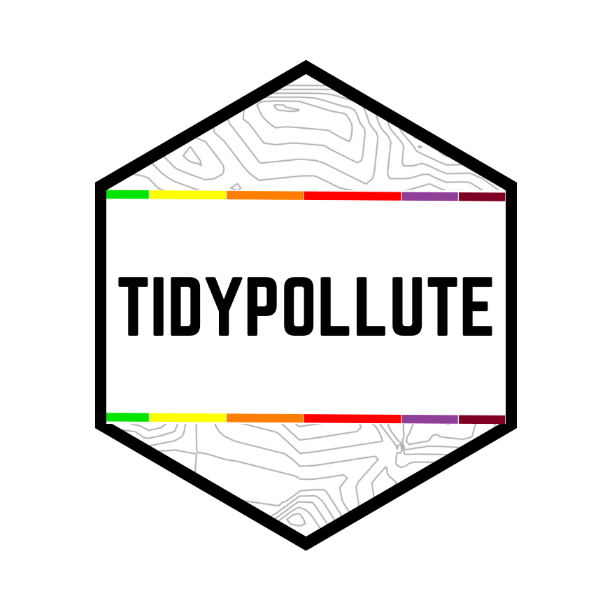

# **tidypollute** 

🚀 **An R package for working with EPA AirData flat files and AQS API!** 🚀  

---

## **Overview**  
**tidypollute** is a lightweight R package designed to make working with EPA air quality data **easy, tidy, and efficient**. Whether you're a researcher, policymaker, or just an environmental data enthusiast, this package helps you import, clean, and analyze large-scale air pollution datasets with minimal hassle.  

---

🔥 **Why use tidypollute?**  
✔️ **Tidy**: Designed with the `tidyverse` in mind for seamless integration.  
✔️ **Fast**: Optimized dplyr functions for handling big air quality datasets.  
✔️ **Flexible**: Supports both flat files and (soon!) real-time API queries.  

---

## **📌 Features (Current & Planned)**  
✅ **Read and process EPA AirData flat files**  
✅ **Tidy up and filter air pollution data**  
✅ **Quick and simple visualizations**  
🛠️ **(Coming soon!) Integration with real-time API endpoints**  

---

## **🚀 Getting Started**  

### **Installation**  
If hosted on GitHub, install with:  
```r
devtools::install_github("nelsonroque/tidypollute")
```

### **Load the package**  
```r
library(tidypollute)
```

---

## **💡 Contributions Welcome!**  
Have ideas? Found a bug? Want to improve the package?  
📢 **Join in!** Open an issue or submit a pull request—we’d love your help!  

---

## **🛣️ Roadmap: What's Next?**  
🚀 **Planned Features & Improvements:**  
🔹 Add **codebook** for EPA data exports  
🔹 Generate **DOCX/PDF reports** from air quality data  
🔹 Merge air quality data with **Census demographics**
🔹 Query the **EPA AQS API** (users provide their own token)  
🔹 Interactive mapping integration with **mapview**  

---

🌎 **More Resources:**  
📌 [EPA AQS API Docs](https://aqs.epa.gov/aqsweb/documents/data_api.html)  
📌 [EPA Daily Air Quality Reports](https://www.epa.gov/outdoor-air-quality-data/air-data-daily-air-quality-tracker-pdf-report)  
📌 [Census Reference Files](https://www.census.gov/geographies/reference-files.html)  
📌 [Census GEOIDs](https://www.census.gov/programs-surveys/geography/guidance/geo-identifiers.html)  


---

Ready to make sense of air quality data the **tidy way**? 🌱 Let's go! 🚀
