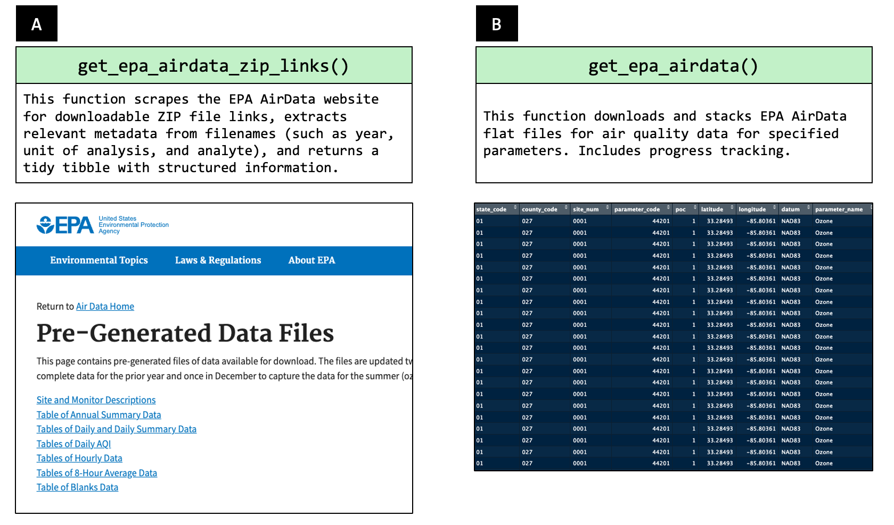

# Summary
Understanding air quality is essential for public health, environmental policy, and research. The **tidypollute** R package currently provides tools to efficiently work with **EPA AirData** flat files [@epa_airdata], offering a structured approach to importing, cleaning, and analyzing air pollution data. This package is designed for environmental researchers, policymakers, and analysts who need streamlined access to large-scale air quality datasets without the overhead of direct API calls.  

The package, published with a GPL-3 license, facilitates efficient data handling of air quality measurements such as **PM2.5, ozone, NO2, CO, and SO2**, and [others](https://aqs.epa.gov/aqsweb/airdata/download_files.html). It allows users to explore long-term trends, compare geographic variations, and generate custom summaries.  

For possible analyte codes, please see `tidypollute::get_epa_airdata_analyte_codes()`.

For the rest of the documentation, please visit: [@tidypollute_docs]

- **Current Features:**
  - **Efficient EPA AirData import**: Load and preprocess flat files by specifying the analyte (e.g., "44201" for ozone), the start and end of the year query (e.g., `start_year`=1991, `end_year`=2000), and the frequency (e.g., `freq` = "hourly", "daily", "annual")  to the function, `get_epa_airdata()`.
  - **Automated metadata scraping**: The function `get_epa_airdata_zip_links()` gathers up-to-date links to AirData files (along with archives through 2024 as built in datasets), and `get_epa_airdata_analyte_codes()` to gather the various file types in a handy table (i.e., tibble).
  - **Streamlined bulk downloads**: `download_stack_epa_airdata()` enables batch downloading of multiple datasets. All you need is a data.frame (or tibble) with a column named `url` for download. This means you can download, for example, 1991 Ozone data and 2001 Particulate Matter, PM2.5 data.
  - **Built-in EPA dataset archives**: `epa_airdata_links`, `epa_airdata_monitoring_sites` and `epa_superfund_npl_sites`, to name a few.
  - **Access to Wearable Air Quality data from Wearables** for sensor data from your fleet or research project. This currently supports the Atmotube Pro device. An API Key is required from Atmotube.
- **Planned Enhancements:**
  - Integration with real-time API endpoints and additional environmental datasets (e.g., water quality).
  - Expansion to support non-U.S. and other wearable air quality data sources (e.g., Purple Air, Flow2).
  - Visualization tools for spatial and temporal trends.

There are several datasets hosted inside of this package.

  - The `epa_airdata_monitoring_sites` dataset contains metadata for EPA AirData monitoring sites (as of February 5, 2025).
  - The `epa_airdata_links` dataset contains links to all pre-generated flat files, while `epa_airdata_links_archive` contains links to flat files, as archived by Archive.org.
  - The `epa_superfund_npl_sites` dataset contains metadata for Superfund sites (as of February 5, 2025).
  - The `us_states` dataset containing basic metadata about states (e.g., abbreviations, size, region)

For help getting started, please see the vignettes included with this package.

# Statement of Need
Air quality is a critical factor influencing public health, yet analyzing EPA AirData can be cumbersome due to the size and complexity of raw datasets. Many existing tools focus on API-based retrieval, but large-scale historical analyses often require working directly with the **flat files** provided by the EPA.  

The **tidypollute** package aims to address this gap by:

- **Providing structured functions** to load and process EPA flat files efficiently  
- **Reducing barriers** for researchers and analysts who may not have experience with raw EPA data processing  
- **Enhancing accessibility** to environmental data for public health, environmental policy, and research.
- **Laying the groundwork** for future environmental data integrations

By offering a lightweight yet powerful R package, for now, tailored for [EPA AirData](https://aqs.epa.gov/aqsweb/airdata/download_files.html) [@epa_airdata], this project aims to support users to make data-driven decisions regarding air quality policy, environmental exposures, and public health.  

If anyone's research depends on air quality data, this tool would make seamless the download and backup of this data, with just one line of code.

# Figures

Figure 1. Primary functions from this package and their results. 
Panel A depicts the function that parses the AirData flat file home page for zip file links. 
Panel B depicts the one-liner R function that downloads the flat files for a specific analyte.

# Acknowledgements
The development of `tidypollute` was made possible with support from NIA (`P01-AG003949`) and Dr. Roque's PSU Start-up funds. 
Thank you [Dr. Charles B Hall](https://einsteinmed.edu/faculty/6913/charles-hall), [Dr. Dean Hosgood](https://einsteinmed.edu/faculty/13282/h-hosgood), and Hailey Andrews, for your support and manuscript reads.
Thank you [Dr. Alexis Santos-Lozada](https://hhd.psu.edu/contact/alexis-santos-santos-lozada) and [Dr. Johnny Felt](https://healthyaging.psu.edu/people/jzf434) for function name brainstorming.
Thank you, Hailey Andrews, for helping brainstorm the name of this package.
Thank you, Karishma Christmas, for your documentation support.

# References
[Data Source](https://aqs.epa.gov/aqsweb/airdata/download_files.html)
[Documentation](https://nelsonroque.github.io/tidypollute/index.html)
